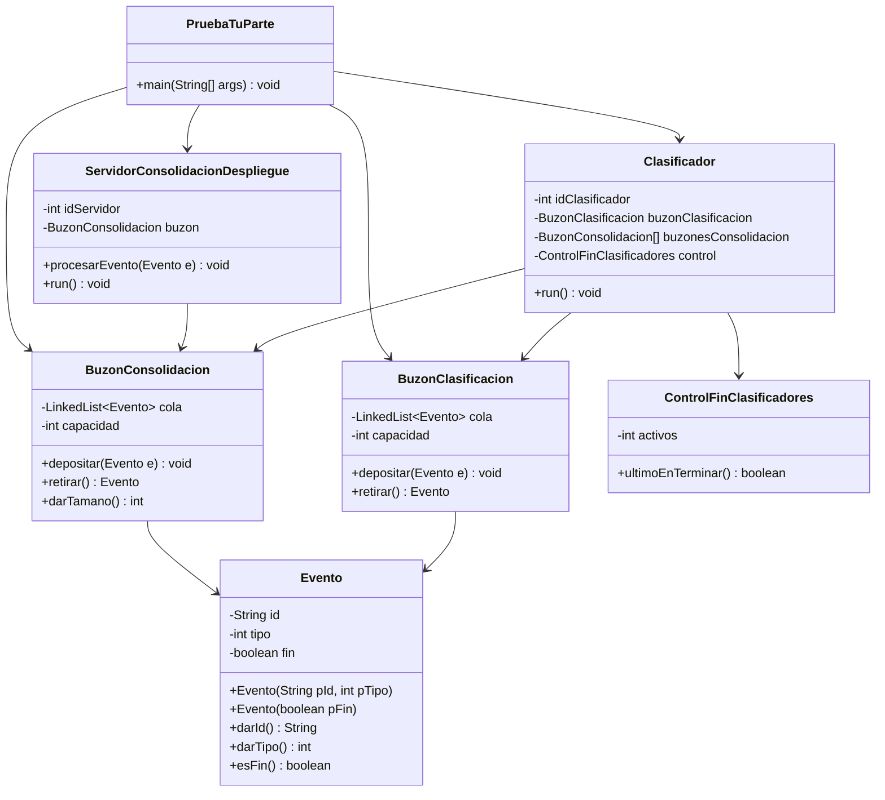

# Informe Caso 3 - Concurrencia y Sincronizacion de Procesos

## 1. Contexto

Este proyecto contiene una implementacion parcial de un sistema concurrente inspirado en el Caso 3. La version que existe en la carpeta `src` modela la parte de clasificacion y consolidacion de eventos, usando hilos, buzones sincronizados y un mecanismo para coordinar la terminacion de varios clasificadores.

El objetivo tecnico de esta implementacion es mostrar:

- Paso de eventos entre productores y consumidores.
- Sincronizacion con `synchronized`, `wait()` y `notifyAll()`.
- Terminacion coordinada de multiples clasificadores.
- Enrutamiento de eventos hacia un servidor segun el tipo del evento.

## 2. Estructura del proyecto

Los archivos encontrados en la carpeta `src` son los siguientes:

| Archivo | Proposito |
|---|---|
| `Evento.java` | Define la estructura basica de un evento. |
| `BuzonClasificacion.java` | Buzon acotado para eventos que esperan ser clasificados. |
| `BuzonConsolidacion.java` | Buzon acotado para eventos que llegan a cada servidor. |
| `Clasificador.java` | Hilo consumidor que toma eventos del buzon de clasificacion y los reenvia al servidor correspondiente. |
| `ControlFinClasificadores.java` | Control compartido para detectar cuando termina el ultimo clasificador. |
| `ServidorConsolidacionDespliegue.java` | Hilo consumidor que procesa eventos de su buzon y termina al recibir un evento fin. |
| `PruebaTuParte.java` | Programa de prueba que arma la arquitectura y deposita eventos manualmente. |

## 3. Diseno de clases

### 3.1 `Evento`

La clase `Evento` es un contenedor de datos con tres atributos:

- `id`: identificador textual del evento.
- `tipo`: numero entero que indica el servidor destino.
- `fin`: bandera que indica si el evento es de terminacion.

Cuenta con dos constructores:

- `Evento(String pId, int pTipo)` para un evento normal.
- `Evento(boolean pFin)` para representar un evento de fin.

Tambien ofrece tres metodos de acceso:

- `darId()`
- `darTipo()`
- `esFin()`

### 3.2 `BuzonClasificacion`

Es un buffer compartido implementado con `LinkedList<Evento>`. Su capacidad es limitada y controla acceso concurrente mediante sincronizacion de monitor.

Metodos principales:

- `depositar(Evento e)`: espera mientras el buzon este lleno, luego inserta el evento y notifica a los hilos en espera.
- `retirar()`: espera mientras el buzon este vacio, luego retira el primer evento y notifica a los hilos en espera.

### 3.3 `BuzonConsolidacion`

Su estructura es igual a la del buzon de clasificacion, pero corresponde al canal de salida de cada servidor.

Ademas de `depositar()` y `retirar()`, incluye:

- `darTamano()`: retorna el numero actual de eventos en la cola.

### 3.4 `Clasificador`

Es un hilo que consume eventos del buzon de clasificacion.

Comportamiento:

1. Retira un evento del buzon de clasificacion.
2. Si el evento no es de fin, obtiene su tipo.
3. Reenvia el evento al buzon de consolidacion asociado a `tipo - 1`.
4. Si recibe un evento de fin, termina su ciclo.
5. El ultimo clasificador en terminar envia un evento de fin a cada servidor de consolidacion.

### 3.5 `ControlFinClasificadores`

Es un contador compartido que registra cuantos clasificadores siguen activos.

Su metodo:

- `ultimoEnTerminar()`: esta sincronizado, decrementa el contador y retorna `true` solo cuando el ultimo clasificador termina.

Esta clase evita condiciones de carrera en la deteccion del ultimo hilo activo.

### 3.6 `ServidorConsolidacionDespliegue`

Es un hilo que representa un servidor de consolidacion y despliegue.

Comportamiento:

1. Retira eventos de su buzon.
2. Si el evento es normal, lo procesa.
3. El procesamiento se simula con una espera aleatoria entre 100 ms y 1000 ms.
4. Si recibe un evento de fin, termina.

### 3.7 `PruebaTuParte`

Es el programa principal de prueba.

En la version actual:

- Crea `ns = 3` servidores.
- Crea `nc = 2` clasificadores.
- Crea un buzon de clasificacion con capacidad 5.
- Crea un buzon de consolidacion para cada servidor con capacidad 3.
- Deposita manualmente eventos de prueba.
- Deposita eventos de fin para que los clasificadores terminen.

## 4. Diagrama de clases



## 5. Funcionamiento del programa

El flujo actual del sistema es el siguiente:

1. `PruebaTuParte` crea la infraestructura de hilos y buzones.
2. Se ponen en marcha los servidores de consolidacion.
3. Se crean y arrancan los clasificadores.
4. El programa principal deposita eventos en el buzon de clasificacion.
5. Cada clasificador toma eventos, lee el tipo y reenvia el evento al servidor correspondiente.
6. Cada servidor procesa el evento recibido y espera el siguiente.
7. Cuando los clasificadores reciben un evento de fin, terminan.
8. El ultimo clasificador en terminar envia un evento de fin a cada servidor.
9. Los servidores terminan al consumir su evento de fin.

## 6. Sincronizacion entre objetos

### 6.1 `PruebaTuParte` y `BuzonClasificacion`

`PruebaTuParte` actua como productor inicial de eventos. Al llamar `depositar()`, si el buzon esta lleno el hilo se bloquea con `wait()`. Cuando haya espacio, el evento se inserta y se ejecuta `notifyAll()` para despertar a los consumidores.

### 6.2 `BuzonClasificacion` y `Clasificador`

Esta relacion es productor-consumidor.

- Si el buzon esta vacio, el clasificador espera con `wait()`.
- Cuando entra un evento, `depositar()` llama a `notifyAll()`.
- Se usa `while` en lugar de `if` para revalidar la condicion despues de despertar.

### 6.3 `Clasificador` y `BuzonConsolidacion`

El clasificador se convierte en productor del buzon de consolidacion.

- Cada evento se deposita en el buzon del servidor correspondiente.
- Si el buzon esta lleno, el clasificador espera.
- Cuando un servidor retira un evento, notifica a los productores con `notifyAll()`.

### 6.4 `BuzonConsolidacion` y `ServidorConsolidacionDespliegue`

El servidor es consumidor del buzon.

- Si no hay eventos, el servidor espera.
- Cuando llega un evento, lo retira y lo procesa.
- El uso de `notifyAll()` evita que varios hilos queden dormidos innecesariamente cuando cambia el estado del buzon.

### 6.5 `Clasificador` y `ControlFinClasificadores`

Los clasificadores comparten un contador de terminacion.

- `ultimoEnTerminar()` es `synchronized`.
- Solo un clasificador puede decrementar y verificar el contador a la vez.
- El clasificador que deja el contador en cero es el ultimo en terminar y se encarga de enviar los eventos de fin a los servidores.

### 6.6 `Clasificador` y `ServidorConsolidacionDespliegue`

La comunicacion no es directa por referencia, sino a traves de `BuzonConsolidacion`.

- El clasificador enruta por `tipo - 1`.
- El servidor consume solo de su propio buzon.
- Esta separacion reduce el acoplamiento entre ambos componentes.

## 7. Validacion

### 7.1 Compilacion

Se compilo el proyecto en un directorio de salida separado para evitar depender de los `.class` viejos que estaban dentro de `src`.

Comando usado:

```powershell
javac -d out src\*.java
```

El bytecode generado para `PruebaTuParte.class` quedo en version 52, compatible con Java 8.

### 7.2 Ejecucion

Se ejecuto la prueba principal con:

```powershell
java -cp out PruebaTuParte
```

Resultado observado:

- Los clasificadores reenviaron eventos a los servidores correctos.
- Los servidores procesaron los eventos y mostraron mensajes de terminacion.
- El ultimo clasificador envio los eventos de fin a todos los servidores.
- El sistema termino correctamente al agotarse los eventos.

### 7.3 Evidencia funcional

En la ejecucion de prueba se observo un flujo coherente con la logica del programa:

- Eventos `E1` a `E5` fueron distribuidos entre servidores segun su tipo.
- Ambos clasificadores terminaron tras recibir el evento de fin.
- Los tres servidores terminaron tras recibir su evento de fin.

## 8. Alcance actual y observaciones

La carpeta actual implementa una parte concreta del caso:

- Cubre el buzon de clasificacion.
- Cubre el enrutamiento por tipo hacia multiples servidores.
- Cubre la terminacion coordinada de varios clasificadores.
- Cubre la espera por eventos en los servidores.

Sin embargo, en esta version del repositorio no aparecen aun las clases de:

- Sensores.
- Broker y analizador.
- Administrador.
- Tampoco se lee aun el archivo de configuracion; en `PruebaTuParte` los valores de `ns` y `nc` estan fijos para la prueba.

Por eso, este informe describe la implementacion realmente presente en la carpeta y no la solucion completa del enunciado.

## 9. Conclusion

El codigo de la carpeta `src` muestra una solucion concurrente basica y bien delimitada para el paso de eventos entre un buzon de clasificacion, varios clasificadores y varios servidores de consolidacion. La sincronizacion se resuelve con monitores de Java, espera condicionada y un control compartido para la terminacion ordenada de los hilos.

El resultado es un prototipo funcional que sirve como base para extender el sistema hacia la arquitectura completa solicitada en el enunciado.
