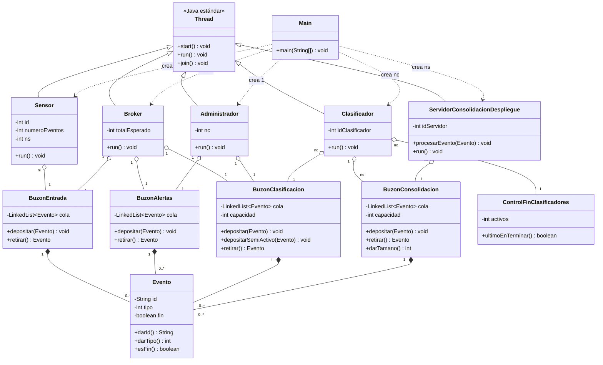

# Informe Caso 3 - Concurrencia y Sincronización de Procesos

**Universidad de los Andes — ISIS 1311 Tecnología e Infraestructura de Cómputo — 2026-1**

## 1. Integrantes del grupo

- Alejandro Cruz Acevedo — 201912149
- Nicolás Castaño Calderón — 202420324

## 2. Contexto

Este proyecto implementa un simulador concurrente de un sistema IoT para un campus universitario, siguiendo la arquitectura descrita en el enunciado del Caso 3. El sistema modela una cadena de procesamiento de eventos en la que varios tipos de actores (sensores, bróker, administrador, clasificadores y servidores de consolidación) cooperan y compiten por recursos compartidos a través de buzones sincronizados.

El interés del problema está en que, aunque la lógica funcional del sistema es relativamente simple (recibir eventos, filtrarlos, clasificarlos y entregarlos), su correcta ejecución depende por completo de cómo se coordinan los hilos que ejecutan cada parte. Un diseño ingenuo puede llevar a condiciones de carrera, bloqueos mutuos o buzones que quedan con eventos atascados al finalizar la ejecución, sin que el programa reporte un error explícito.
Los objetivos técnicos de la implementación son los siguientes:

- Modelar el flujo completo de eventos entre múltiples productores y consumidores organizados en una arquitectura tipo pipeline.
- Aplicar mecanismos de sincronización usando exclusivamente las primitivas básicas de Java permitidas por el enunciado: synchronized, wait(), notifyAll(), yield(), join() y CyclicBarrier.
- Combinar los dos patrones de espera exigidos, espera pasiva y espera semi-activa, asignándolos según lo que indica la Figura 1 del enunciado.
- Coordinar la terminación ordenada del sistema mediante eventos de fin que se propagan por la cadena, garantizando que todos los hilos cierren y que todos los buzones queden vacíos.
- Evitar condiciones de carrera y bloqueos mutuos mediante el uso correcto de monitores y variables condicionales.

## 3. Estructura del proyecto

Los archivos `.java` del proyecto se encuentran en la carpeta `src`. La implementación se dividió en dos bloques de trabajo: la mitad de entrada del sistema (sensores, bróker, administrador y sus buzones) y la mitad de clasificación y consolidación (clasificadores, servidores y sus buzones), más un orquestador principal que lee la configuración e inicia el sistema completo.

| Archivo                                | Propósito                                                                                                                                                                                     |
| -------------------------------------- | --------------------------------------------------------------------------------------------------------------------------------------------------------------------------------------------- |
| `Evento.java`                          | Define la estructura básica de un evento, con identificador, tipo y bandera de fin.                                                                                                           |
| `BuzonEntrada.java`                    | Buzón ilimitado donde los sensores depositan los eventos generados.                                                                                                                           |
| `BuzonAlertas.java`                    | Buzón ilimitado donde el bróker deposita los eventos sospechosos; el administrador los consume con espera semi-activa.                                                                        |
| `BuzonClasificacion.java`              | Buzón acotado (capacidad `tam1`) para eventos listos para clasificar. Ofrece dos modos de depósito: pasivo para el bróker y semi-activo para el administrador.                                |
| `BuzonConsolidacion.java`              | Buzón acotado (capacidad `tam2`) correspondiente a cada servidor de consolidación.                                                                                                            |
| `Sensor.java`                          | Hilo productor que genera un número asignado de eventos y los deposita en el buzón de entrada.                                                                                                |
| `Broker.java`                          | Hilo que lee del buzón de entrada, clasifica cada evento como normal o sospechoso, y lo reenvía al buzón correspondiente.                                                                     |
| `Administrador.java`                   | Hilo que lee alertas con espera semi-activa, descarta las confirmadas y reenvía las inofensivas al buzón de clasificación.                                                                    |
| `Clasificador.java`                    | Hilo consumidor que toma eventos del buzón de clasificación y los enruta al buzón del servidor correspondiente según su tipo.                                                                 |
| `ControlFinClasificadores.java`        | Contador compartido que permite identificar al último clasificador en terminar.                                                                                                               |
| `ServidorConsolidacionDespliegue.java` | Hilo consumidor que procesa eventos de su propio buzón y termina al recibir un evento de fin.                                                                                                 |
| `Main.java`                            | Programa principal: lee el archivo `config.txt`, instancia los componentes, arranca los hilos y espera su terminación con `join()`.                                                           |
| `PruebaTuParte.java`                   | Driver auxiliar heredado de pruebas tempranas del submódulo de clasificación. No forma parte de la ejecución completa del sistema, pero se conserva como evidencia del proceso de desarrollo. |

El archivo de configuración `config.txt` contiene los parámetros del simulador en formato `clave=valor`, como por ejemplo:

```
ni=5
base=10
nc=3
ns=4
tam1=5
tam2=3
```

Donde `ni` es el número de sensores, `base` el número base de eventos por sensor, `nc` el número de clasificadores, `ns` el número de servidores de consolidación, `tam1` la capacidad del buzón de clasificación y `tam2` la capacidad de cada buzón de consolidación.

## 4. Diseño de clases

### 4.1 `Evento`

La clase `Evento` representa el objeto de datos que fluye a lo largo de todo el pipeline. Es creado por los sensores y posteriormente manipulado (leído, enrutado, procesado o descartado) por el bróker, el administrador, los clasificadores y los servidores a través de los distintos buzones.

Tiene tres atributos:

- `id`: identificador textual del evento, con formato `"S{idSensor}-{secuencial}"`.
- `tipo`: número entero entre 1 y `ns` que indica simultáneamente el tipo del evento y el servidor de destino.
- `fin`: bandera booleana que indica si el evento es un marcador de terminación.

La clase ofrece dos constructores, uno para eventos normales y otro para eventos de fin, y tres métodos de consulta: `darId()`, `darTipo()` y `esFin()`. Se decidió mantener los atributos privados y exponer el estado únicamente mediante estos métodos para preservar la inmutabilidad efectiva del evento una vez creado.

### 4.2 `BuzonEntrada`

Es el buzón donde los sensores depositan los eventos que generan. Su capacidad es ilimitada, por lo que ningún sensor puede bloquearse al depositar, y cuenta con un único consumidor que es el bróker.

Internamente se implementa con una `LinkedList<Evento>` y todos sus métodos son `synchronized` para garantizar exclusión mutua entre los múltiples sensores que depositan concurrentemente y el bróker que lee.

Tiene dos métodos principales:

- `depositar(Evento e)`: inserta el evento al final de la cola y ejecuta `notifyAll()` para despertar al bróker si estuviera dormido. Nunca bloquea al productor porque el buzón es ilimitado.
- `retirar()`: implementa **espera pasiva**. Si la cola está vacía, el hilo se duerme con `wait()` dentro de un bucle `while`. Cuando llega un evento, el hilo se despierta, revalida la condición (para protegerse frente a despertares espurios) y retira el primer evento de la cola.

### 4.3 `BuzonAlertas`

Tiene la misma estructura que el buzón de entrada (`LinkedList` ilimitada con métodos sincronizados), pero su método `retirar()` implementa **espera semi-activa** en lugar de pasiva. Esta diferencia es intencional y corresponde directamente a lo que indica la Figura 1 del enunciado: la rama de alertas está marcada con flechas punteadas, lo que significa que la comunicación en ese punto debe usar espera semi-activa.

En concreto, cuando el administrador intenta retirar un evento y la cola está vacía, en vez de dormirse con `wait()` entra en un bucle que ejecuta `Thread.yield()`. Esto significa que el hilo cede el procesador repetidamente en vez de quedarse dormido, consumiendo algo más de CPU pero respondiendo más rápido a la llegada de un nuevo evento. El método sigue siendo `synchronized` para garantizar que la verificación de la condición y el retiro del elemento se ejecuten de forma atómica.

El lado del bróker no cambia: `depositar(Evento e)` nunca bloquea (el buzón es ilimitado) y al insertar hace `notifyAll()` para mantener un comportamiento coherente con la estructura general de los buzones del sistema, aunque en la práctica el administrador no esté esperando con `wait()`.

### 3.4 `BuzonClasificacion`

Buzón de capacidad limitada `tam1`. Tiene un único método `retirar()` con espera pasiva (los clasificadores), y **dos métodos de depósito**:

- `depositar(Evento e)`: espera pasiva. Si el buzón está lleno, el hilo se duerme con `wait()`. Lo usa el bróker.
- `depositarSemiActivo(Evento e)`: espera semi-activa. Si el buzón está lleno, el hilo entra en un bucle con `Thread.yield()` hasta que haya espacio. Lo usa el administrador.

Esta distinción es necesaria porque la Figura 1 muestra que el bróker llega al buzón de clasificación por una flecha sólida (pasiva), mientras que el administrador llega por una punteada (semi-activa). En ambos casos, tras depositar se hace `notifyAll()` para despertar a los clasificadores que pudieran estar dormidos.

### 4.5 `BuzonConsolidacion`

Buzón de capacidad limitada `tam2`, del cual existe una instancia por servidor de consolidación. Usa `synchronized`, `wait()` y `notifyAll()` tanto en el depósito como en el retiro, al estilo del productor-consumidor clásico.

El método `depositar(Evento e)` bloquea al clasificador productor si el buzón está lleno, usando espera pasiva, y lo despierta cuando el servidor retire un evento. El método `retirar()` bloquea al servidor consumidor si el buzón está vacío, también con espera pasiva. Adicionalmente se incluye un método `darTamano()` sincronizado que permite consultar la ocupación actual de la cola, útil durante la validación para confirmar que todos los buzones quedan vacíos al final de la ejecución.

### 4.6 `Sensor`

Hereda de `Thread`. Es el productor inicial del sistema: genera los eventos que alimentan todo el pipeline. Recibe por constructor su identificador `id`, el número de eventos que debe generar (`numeroEventos`, calculado en el `Main` como `base × id`), el número de servidores `ns`, el `BuzonEntrada` compartido y la barrera cíclica de arranque.

Su método `run()` sigue esta secuencia:

1. Llama a `barrera.await()` como primera instrucción, quedando en espera hasta que todos los hilos del sistema hayan alcanzado el mismo punto.
2. Entra en un bucle que se repite `numeroEventos` veces. En cada iteración crea un `Evento` con identificador `"S{id}-{secuencial}"` y tipo pseudoaleatorio entre 1 y `ns`.
3. Deposita cada evento en el `BuzonEntrada`.
4. Al terminar el bucle, imprime un mensaje de terminación con su identificador y la cantidad de eventos generados.

Se decidió construir el identificador como una cadena en vez de un número para que sea trivialmente legible en las trazas de ejecución y para garantizar unicidad global sin necesidad de un contador centralizado: el prefijo `S{id}` ya separa los espacios de nombres de cada sensor.

### 4.7 `Broker`

Hereda de `Thread`. Es el intermediario que clasifica los eventos en normales o sospechosos. Recibe por constructor el `totalEsperado` (calculado por el `Main` como `base × ni × (ni + 1) / 2`), el `BuzonEntrada`, el `BuzonAlertas`, el `BuzonClasificacion` y la barrera.

Su método `run()` opera de la siguiente forma:

1. Llama a `barrera.await()`.
2. Entra en un bucle que se ejecuta `totalEsperado` veces. En cada iteración retira un evento del `BuzonEntrada` y genera un número pseudoaleatorio entre 0 y 200.
3. Si el número es múltiplo de 8, el evento se considera sospechoso y se deposita en el `BuzonAlertas`.
4. Si no, se considera válido y se deposita en el `BuzonClasificacion` con el método `depositar` (espera pasiva).
5. Cuando sale del bucle, deposita un `Evento` de fin en el `BuzonAlertas` para avisar al administrador que no llegarán más eventos, e imprime su mensaje de terminación.

La decisión de calcular el `totalEsperado` en el `Main` y pasárselo al bróker por constructor responde a un principio de separación de responsabilidades: el bróker no necesita conocer ni el número de sensores ni la base de eventos, solo cuántos eventos tiene que procesar. Esto deja la fórmula de cálculo en un único lugar y facilita pruebas futuras con configuraciones distintas.

### 4.8 `Administrador`

Hereda de `Thread`. Es el actor encargado de inspeccionar en profundidad los eventos sospechosos enviados por el bróker. Recibe por constructor el `BuzonAlertas`, el `BuzonClasificacion`, el número de clasificadores `nc` y la barrera.

Su método `run()` se comporta así:

1. Llama a `barrera.await()`.
2. Entra en un bucle que retira eventos del `BuzonAlertas` usando espera semi-activa (como está definida en el propio buzón).
3. Si el evento retirado es de fin, sale del bucle.
4. Si es un evento normal, genera un número pseudoaleatorio entre 0 y 20. Si el número es múltiplo de 4, el evento se considera una falsa alarma y se reenvía al `BuzonClasificacion` usando `depositarSemiActivo`. En caso contrario, el evento se confirma como malicioso y se descarta.
5. Al salir del bucle, y antes de terminar, deposita `nc` eventos de fin en el `BuzonClasificacion` (uno por cada clasificador), también con `depositarSemiActivo`.
6. Imprime su mensaje de terminación.

El orden de esas últimas dos operaciones es importante: los `nc` eventos de fin se depositan **antes** de que el administrador termine su ejecución. Esto garantiza que los clasificadores, que pueden estar esperando pasivamente sobre el buzón de clasificación, reciban siempre su señal de fin y no queden bloqueados indefinidamente.

### 4.9 `Clasificador`

Hereda de `Thread`. Es el actor que enruta cada evento hacia el servidor de consolidación correspondiente. Recibe por constructor su identificador `idClasificador`, el `BuzonClasificacion` compartido, el arreglo de `BuzonConsolidacion` (uno por servidor), el `ControlFinClasificadores` compartido y la barrera.

Su método `run()` funciona de la siguiente manera:

1. Llama a `barrera.await()`.
2. Entra en un bucle que retira eventos del `BuzonClasificacion` uno por uno.
3. Si el evento retirado es normal, consulta su tipo y lo deposita en el buzón `buzonesConsolidacion[tipo - 1]` (el arreglo está indexado desde 0, mientras que los tipos van de 1 a `ns`).
4. Si el evento es de fin, invoca `control.ultimoEnTerminar()`. Si ese método retorna `true`, este clasificador es el último activo y se encarga de depositar `ns` eventos de fin, uno en cada buzón de consolidación, para que los servidores puedan terminar. En cualquiera de los dos casos (sea o no el último), el clasificador sale del bucle e imprime su mensaje de terminación.

La lógica de "el último clasificador que termina propaga los fines a los servidores" es crítica para la corrección del cierre del sistema. Si cada clasificador enviara su propio fin a cada servidor, los servidores recibirían `nc × ns` eventos de fin en lugar de `ns`, y terminarían apenas al ver el primero, dejando los demás atascados en los buzones.

### 4.10 `ControlFinClasificadores`

Clase utilitaria que mantiene un contador entero compartido por todos los clasificadores. Su constructor recibe el número inicial de clasificadores activos `n` y lo almacena en el atributo `activos`.

Su único método, `ultimoEnTerminar()`, está declarado `synchronized`. Decrementa el contador y retorna `true` si el resultado es cero, es decir, si el clasificador que llamó al método fue el último en registrarse como terminado. La sincronización garantiza que el decremento y la comparación se ejecuten de forma atómica: sin ella, dos clasificadores podrían leer simultáneamente el valor `activos = 1`, decrementar ambos a `0`, y ambos creerían ser el último, provocando que los servidores recibieran `2 × ns` eventos de fin.

Se decidió separar esta responsabilidad en una clase propia para mantener el `Clasificador` centrado en la lógica de enrutamiento y dejar toda la coordinación de cierre encapsulada en un objeto con una única función clara.

### 4.11 `ServidorConsolidacionDespliegue`

Hereda de `Thread`. Es el consumidor final de la cadena: procesa y despliega los eventos dirigidos a él. Recibe por constructor su identificador `idServidor`, su `BuzonConsolidacion` asociado y la barrera.

Su método `run()` sigue esta lógica:

1. Llama a `barrera.await()`.
2. Entra en un bucle que retira eventos de su buzón.
3. Si el evento es normal, lo procesa invocando el método `procesarEvento`, que simula el trabajo durmiendo el hilo durante un tiempo pseudoaleatorio entre 100 y 1000 milisegundos (rango exigido por el enunciado).
4. Si el evento es de fin, sale del bucle e imprime el mensaje de terminación.

El método `procesarEvento` está separado del `run()` para hacer explícita la distinción entre la lógica de coordinación (recibir y reconocer el tipo de evento) y la lógica de procesamiento (trabajar sobre el evento mismo). En un sistema real, este método sería el punto de integración con la consolidación y despliegue efectivos hacia los clientes.

### 4.12 `Main`

Clase que orquesta la puesta en marcha y la terminación del sistema completo. No hereda de `Thread`: se ejecuta en el hilo principal del programa y su única responsabilidad es montar la infraestructura y esperar a que todos los hilos terminen.

La secuencia del método `main` es la siguiente:

1. Carga el archivo `config.txt` usando `java.util.Properties` y lee los parámetros `ni`, `base`, `nc`, `ns`, `tam1` y `tam2`.
2. Calcula el total de eventos esperados como `base × ni × (ni + 1) / 2`. Esta fórmula viene de que el sensor `i` genera `base × i` eventos, por lo que la suma sobre `i = 1, 2, ..., ni` corresponde a `base` multiplicado por la suma de los primeros `ni` enteros.
3. Calcula el número de partes de la barrera cíclica como `ni + nc + ns + 2`, donde el `+ 2` corresponde al bróker y al administrador.
4. Instancia todos los buzones, el control de fin de clasificadores y la `CyclicBarrier`.
5. Instancia y arranca los hilos en este orden: servidores, clasificadores, administrador, bróker y sensores.
6. Invoca `join()` sobre todos los hilos para bloquear el hilo principal hasta que cada uno haya terminado.
7. Imprime el mensaje `"Simulacion completada"`.

El orden de arranque se escogió de forma defensiva para que los consumidores existan antes que sus productores correspondientes. En la práctica, gracias a la barrera cíclica de arranque, ningún hilo comienza a producir o consumir hasta que todos estén efectivamente activos, por lo que el orden no es estrictamente necesario para la corrección. Sin embargo, se mantiene como convención de lectura: el código describe el pipeline de derecha a izquierda, igual que se lee la Figura 1 del enunciado.

El uso de `join()` al final cumple una doble función. Por un lado, es el mecanismo que permite al hilo principal detectar que la simulación cerró limpiamente (todos los hilos terminaron sin quedarse bloqueados). Por otro lado, el mensaje final actúa como señal de validación durante las pruebas: si aparece, ningún buzón quedó con eventos atascados y ninguna condición de espera quedó colgada.

## 5. Diagrama de clases

El siguiente diagrama muestra las relaciones estructurales entre las clases del sistema. Se utilizan tres tipos de relaciones: **herencia** (`<|--`) para indicar que los cinco actores concurrentes extienden la clase `Thread` de Java; **composición** (`*--`) entre los buzones y la clase `Evento`, reflejando que un buzón contiene eventos como parte de su estructura interna; **agregación** (`o--`) entre los hilos y los buzones, indicando que los hilos usan buzones compartidos sin poseerlos; y **dependencia** (`..>`) entre `Main` y los hilos, marcando que `Main` los instancia pero no mantiene una relación estructural con ellos durante la ejecución.

Las multiplicidades anotadas en cada relación (`ni`, `nc`, `ns`) conectan el diagrama directamente con los parámetros del archivo de configuración.



## 6. Funcionamiento del programa

El flujo de ejecución del sistema, desde la invocación de `Main` hasta su terminación, sigue la siguiente secuencia:

1. `Main` carga el archivo `config.txt`, calcula el total esperado de eventos y el número de partes de la barrera cíclica, e instancia los buzones, el control de fin de clasificadores y la barrera.

2. Se crean y arrancan los hilos en orden defensivo: primero los servidores de consolidación, luego los clasificadores, después el administrador, el bróker y finalmente los sensores. Todos quedan bloqueados en `barrera.await()` inmediatamente después de iniciar.

3. Cuando el último hilo alcanza la barrera, esta libera a los `ni + nc + ns + 2` participantes de forma simultánea y el sistema comienza a procesar eventos.

4. Los sensores generan sus eventos en paralelo. Cada sensor `i` produce `base × i` eventos con identificadores de la forma `S{i}-{secuencial}` y los deposita en el `BuzonEntrada`. Cada sensor termina al agotar su cuota asignada.

5. El bróker retira eventos del `BuzonEntrada` uno por uno. Por cada evento genera un número pseudoaleatorio entre 0 y 200: si es múltiplo de 8, el evento se clasifica como sospechoso y se envía al `BuzonAlertas`; en caso contrario, se clasifica como válido y se envía al `BuzonClasificacion`. Cuando el bróker ha procesado el total esperado de eventos, deposita un evento de fin en el `BuzonAlertas` y termina.

6. En paralelo, los clasificadores retiran eventos del `BuzonClasificacion` y los enrutan al `BuzonConsolidacion` del servidor correspondiente, seleccionado con el tipo del evento.

7. También en paralelo, el administrador consume eventos del `BuzonAlertas` con espera semi-activa. Por cada evento genera un número pseudoaleatorio entre 0 y 20: si es múltiplo de 4, el evento se considera una falsa alarma y se reenvía al `BuzonClasificacion`; en caso contrario, se descarta. Al recibir el evento de fin enviado por el bróker, el administrador deposita `nc` eventos de fin en el `BuzonClasificacion` (uno por cada clasificador) y termina.

8. Cada clasificador, al retirar un evento de fin del `BuzonClasificacion`, registra su terminación llamando a `control.ultimoEnTerminar()`. El único clasificador que recibe `true` como respuesta deposita `ns` eventos de fin, uno en cada `BuzonConsolidacion`, antes de terminar. Los demás clasificadores terminan inmediatamente.

9. Cada servidor de consolidación, al retirar su evento de fin, sale del bucle de procesamiento y termina.

10. El hilo principal, que está bloqueado en `join()` sobre todos los hilos, se desbloquea a medida que cada uno termina. Cuando todos han cerrado, imprime el mensaje `"Simulacion completada"`, lo que indica que no quedó ningún hilo bloqueado y, por diseño del protocolo de eventos de fin, que todos los buzones quedaron vacíos.

Durante toda la ejecución, cuatro tipos de actores operan en paralelo sin necesidad de coordinarse directamente: los sensores que producen, el bróker que filtra, el administrador que inspecciona y los clasificadores y servidores que consumen. Toda la coordinación entre ellos se resuelve a través de los buzones sincronizados y del protocolo de propagación de eventos de fin, sin necesidad de comunicación directa entre los hilos.

## 7. Estrategia de sincronización

Toda la coordinación entre hilos del sistema se resuelve exclusivamente con las primitivas básicas de Java permitidas por el enunciado: `synchronized`, `wait()`, `notifyAll()`, `yield()`, `join()` y `CyclicBarrier`. No se utilizan estructuras de más alto nivel como `BlockingQueue`, `Semaphore` ni `Lock`. Esta restricción obliga a modelar cada punto de espera del sistema de forma explícita, lo que hace más visible el costo y el efecto de cada decisión de sincronización.

Esta sección se divide en tres partes: la justificación del uso combinado de espera pasiva y semi-activa según la Figura 1, el rol de la `CyclicBarrier` como punto de sincronización global al arranque, y finalmente el análisis de la sincronización para cada pareja de objetos que interactúa a través de un recurso compartido.

### 7.1 Espera pasiva vs espera semi-activa

El enunciado exige utilizar los dos patrones de espera en el sistema. La Figura 1 lo indica gráficamente: las flechas sólidas representan caminos con espera pasiva y las flechas punteadas representan caminos con espera semi-activa. La distinción entre ambos patrones no es ornamental, tiene consecuencias concretas en términos de consumo de recursos y latencia de respuesta.

La **espera pasiva** se implementa en este proyecto con el patrón clásico de monitor: el hilo que llega a un recurso ocupado entra en un bucle `while (condicion) { wait(); }`. La llamada a `wait()` libera el monitor del objeto y suspende el hilo, de modo que no consume CPU mientras espera. Cuando otro hilo modifica el estado del recurso y ejecuta `notifyAll()`, el planificador del sistema operativo vuelve a poner el hilo dormido en la cola de ejecución, este reintenta adquirir el monitor y revalida la condición con el `while`. El uso de `while` en lugar de `if` protege contra despertares espurios, una característica de la JVM por la cual un hilo puede salir de `wait()` sin que haya recibido una notificación explícita.

La **espera semi-activa** se implementa con un bucle `while (condicion) { Thread.yield(); }`. La diferencia fundamental es que el hilo no se duerme: cede voluntariamente el procesador al planificador, pero permanece en estado ejecutable. Tan pronto como el planificador le vuelve a asignar tiempo de CPU, el hilo revalida la condición sin necesidad de ser notificado por otro. Esto tiene dos consecuencias: el hilo responde más rápido a cambios de estado (no depende de que otro le envíe un `notify`), pero consume más CPU que en espera pasiva, ya que hace verificaciones activas en lugar de dormir.

En este proyecto, la correspondencia con la Figura 1 se materializó de la siguiente forma:

- **Espera pasiva** (flechas sólidas): se usa en el camino principal del pipeline. Los sensores entregan al bróker a través del `BuzonEntrada`, el bróker entrega a los clasificadores a través del `BuzonClasificacion` con el método `depositar`, y los clasificadores entregan a los servidores a través del `BuzonConsolidacion`.
- **Espera semi-activa** (flechas punteadas): se usa en la rama de alertas. El bróker entrega al administrador a través del `BuzonAlertas`, y el administrador reinyecta al buzón de clasificación a través del método `depositarSemiActivo` del `BuzonClasificacion`.

Esta distribución de patrones es más que un ejercicio de cumplimiento: refleja una decisión razonable de arquitectura. El camino principal del pipeline es el de mayor volumen (todos los eventos pasan por él), por lo que conviene usar espera pasiva para no desperdiciar CPU durante los momentos en que los buzones están momentáneamente vacíos o llenos. La rama de alertas, en cambio, recibe solo una fracción pequeña de los eventos (los que resultan ser múltiplos de 8), por lo que es un canal de baja carga en el que la espera semi-activa no genera un costo significativo y sí permite al administrador responder rápidamente cuando llega una alerta aislada.

### 7.2 Barrera de arranque con `CyclicBarrier`

El enunciado lista explícitamente a `CyclicBarrier` entre las primitivas de sincronización permitidas. En este proyecto se decidió usarla como **barrera de arranque global** del sistema: todos los hilos que participan en el pipeline llaman a `barrera.await()` como primera instrucción de su método `run()`, antes de empezar cualquier trabajo productivo.

El número de partes de la barrera se calcula en el `Main` como `ni + nc + ns + 2`, donde el `+ 2` corresponde al bróker y al administrador. Cuando el último participante llega al punto de espera, la barrera libera a todos los hilos simultáneamente y el sistema comienza a operar.

Esta decisión cumple tres funciones. La primera es **predictibilidad**: sin la barrera, los primeros hilos creados podrían empezar a procesar (o intentar hacerlo) antes de que los demás estén efectivamente arrancados, lo que genera trazas de ejecución distintas entre corridas y dificulta el análisis del comportamiento del sistema. La segunda es **claridad conceptual**: el punto exacto en el que "el sistema empieza a correr" queda definido de forma explícita y observable, en lugar de ser un efecto emergente del orden en el que el planificador activa los hilos. La tercera es **cobertura del temario**: el enunciado menciona `CyclicBarrier` como primitiva permitida y conviene emplearla al menos una vez, tanto para ejercitar el concepto como para tener algo concreto que discutir en el informe y en la pregunta del parcial asociada al caso.

Vale la pena notar que, estrictamente hablando, la barrera no es necesaria para la corrección del sistema: los buzones sincronizados ya garantizan que ningún consumidor procese un evento antes de que este exista, simplemente porque quedarían esperando sobre un buzón vacío. La barrera es una capa adicional de sincronización que hace el comportamiento del arranque más predecible y más fácil de razonar, pero el sistema funcionaría de todos modos sin ella. Esta distinción es importante: ayuda a entender la diferencia entre sincronización necesaria (la que evita errores) y sincronización conveniente (la que mejora las propiedades del sistema sin ser estrictamente requerida para su corrección).

### 7.3 Sincronización entre pares de objetos

El enunciado solicita explicar, para cada pareja de objetos que interactúa, cómo se realiza la sincronización. A continuación se analiza cada relación del sistema identificando el recurso compartido que media la interacción, el patrón de espera que se usa en cada extremo y las decisiones relevantes.

**Sensor ↔ BuzonEntrada.** Los sensores son los productores del buzón de entrada y cada uno deposita sus eventos de forma concurrente con los demás. Como el buzón es ilimitado, el método `depositar` nunca bloquea por capacidad, pero se declara `synchronized` para garantizar exclusión mutua sobre la estructura de datos interna: sin esta protección, dos sensores podrían intentar modificar la `LinkedList` simultáneamente y corromperla. Tras insertar cada evento se ejecuta `notifyAll()` para despertar al bróker si estaba dormido esperando eventos.

**BuzonEntrada ↔ Broker.** El bróker es el único consumidor de este buzón y opera con espera pasiva. Su método `retirar` revisa la cola en un bucle `while (cola.isEmpty()) { wait(); }`, de modo que si llega a un buzón vacío libera el monitor y se suspende. Cuando un sensor deposita y ejecuta `notifyAll()`, el bróker reanuda, revalida la condición con el `while` para protegerse de despertares espurios, y extrae el evento.

**Broker ↔ BuzonAlertas.** El bróker es el único productor de este buzón. Como tiene capacidad ilimitada, el depósito no bloquea, pero el método sigue siendo `synchronized` porque el administrador puede estar leyendo concurrentemente. Después de cada inserción no es estrictamente necesario emitir una señal (el administrador no usa espera pasiva), pero se mantiene la convención por consistencia con los demás buzones.

**BuzonAlertas ↔ Administrador.** El administrador es el único consumidor de este buzón y utiliza **espera semi-activa**. Su método `retirar` entra en un bucle `while (cola.isEmpty()) { Thread.yield(); }`, cediendo el procesador sin dormirse. El método sigue declarado `synchronized` para asegurar atomicidad entre la verificación de la condición y la extracción del elemento: sin esa protección, el administrador podría ver la cola con un elemento, entrar al bloque de extracción, y encontrarla ya vacía porque otro hilo la modificó entre medias (aunque en este sistema el administrador es el único consumidor, mantener el `synchronized` es defensa a bajo costo).

**Broker ↔ BuzonClasificacion.** Relación productor-consumidor clásica con buzón acotado de capacidad `tam1`. El bróker deposita usando el método `depositar` (espera pasiva). Si el buzón está lleno, el bróker queda dormido con `wait()` hasta que un clasificador retire un evento y emita `notifyAll()`. Después de cada depósito exitoso, el bróker también emite `notifyAll()` para despertar a los clasificadores que pudieran estar esperando por eventos.

**Administrador ↔ BuzonClasificacion.** Mismo buzón que el anterior, pero con el administrador como productor. En este caso se usa el método `depositarSemiActivo`: si el buzón está lleno, el administrador entra en un bucle con `Thread.yield()` hasta que haya espacio. La decisión de que este mismo buzón exponga dos métodos distintos de depósito (uno pasivo y uno semi-activo) es consecuencia directa de la Figura 1 del enunciado, que muestra al bróker llegando por una flecha sólida y al administrador llegando por una flecha punteada. El buzón encapsula ambos modos sin que los productores tengan que preocuparse por cómo funcionan internamente.

**BuzonClasificacion ↔ Clasificador.** Los clasificadores son consumidores con espera pasiva. Su `retirar` se duerme con `wait()` cuando el buzón está vacío, y tras extraer un evento emite `notifyAll()` para liberar a cualquier productor (bróker o administrador) que estuviera esperando por espacio. Como hay varios clasificadores concurrentes leyendo del mismo buzón, la exclusión mutua del `synchronized` garantiza que cada evento sea recibido por exactamente uno de ellos.

**Clasificador ↔ BuzonConsolidacion.** Relación productor-consumidor con buzón acotado de capacidad `tam2`. Los clasificadores son productores con espera pasiva: si el buzón del servidor destino está lleno, el clasificador se duerme con `wait()` hasta que el servidor retire un evento. Cada buzón tiene un único servidor asociado, pero puede recibir eventos de varios clasificadores concurrentes, por lo que el `synchronized` es necesario también en el lado del productor.

**BuzonConsolidacion ↔ ServidorConsolidacionDespliegue.** Cada servidor es el único consumidor de su buzón y opera con espera pasiva. Su bucle es simple: retira un evento, lo procesa durante un tiempo pseudoaleatorio entre 100 y 1000 milisegundos, y vuelve a esperar. Como el servidor es el único consumidor, al retirar un evento no es estrictamente necesario emitir un `notifyAll()`, pero se hace de todos modos por consistencia y porque desbloquear posibles productores esperando por espacio es siempre correcto.

**Clasificador ↔ Clasificador (vía ControlFinClasificadores).** Esta es la única interacción del sistema que no pasa por un buzón sino por un objeto compartido de coordinación. Los clasificadores compiten por decrementar el contador de activos al momento de terminar, y necesitan que exactamente uno de ellos sea identificado como "el último". El método `ultimoEnTerminar` es `synchronized` para que el decremento del contador y la comparación con cero se ejecuten como una operación atómica. Sin esta protección, dos clasificadores podrían leer `activos = 1` simultáneamente, ambos decrementarlo a `0` y ambos creer ser el último, lo que provocaría que los servidores recibieran dos eventos de fin por cada uno y terminaran prematuramente dejando eventos atascados en los buzones.

**Todos los hilos activos ↔ CyclicBarrier.** La barrera de arranque conecta a los `ni + nc + ns + 2` hilos del sistema en un único punto de sincronización global. Cada hilo llama a `barrera.await()` al comienzo de su `run()` y queda bloqueado hasta que todos los demás hayan llegado. Cuando el último llega, la barrera los libera simultáneamente. A diferencia de los buzones, que sincronizan pares de hilos a través de un recurso compartido, la barrera sincroniza a todo el conjunto en un único instante.

## 8. Validación

Para validar la corrección del sistema se realizaron dos pruebas de ejecución con configuraciones de parámetros distintas. El objetivo fue verificar tres propiedades fundamentales: **conservación de eventos** (ningún evento se pierde ni se duplica entre lo que generan los sensores y lo que procesan los servidores, salvo los que el administrador descarta explícitamente), **terminación limpia** (todos los hilos alcanzan su estado de terminación y el hilo principal puede cerrar con `join()`), y **ausencia de bloqueos mutuos** (el sistema no se queda colgado indefinidamente ni deja buzones con eventos atascados al finalizar).

Las dos configuraciones se eligieron para cubrir dos regímenes distintos: una básica que permite seguir manualmente el flujo de cada evento, y otra de estrés que fuerza contención real en los buzones y pone a prueba la sincronización bajo alta concurrencia.

### 8.1 Prueba 1: configuración básica

Configuración:

```
ni=2  base=2  nc=2  ns=2  tam1=3  tam2=2
```

Total esperado de eventos: `base × ni × (ni + 1) / 2 = 2 × 2 × 3 / 2 = 6`. Partes de la barrera: `ni + nc + ns + 2 = 8`.

Extracto representativo de la salida:

```
Configuracion: ni=2 base=2 nc=2 ns=2 tam1=3 tam2=2
Total eventos esperados: 6, partes barrera: 8
Sensor 1 termina (2 eventos).
Sensor 2 termina (4 eventos).
Broker termina (6 eventos procesados).
Clasificador 2 envió evento S2-1 al servidor 2
Servidor 1 procesando evento S1-2 de tipo 1
...
Administrador termina, envió 2 FINes a BuzonClasificacion.
Clasificador 1 termina.
Clasificador 2 termina.
Servidor 1 termina.
Servidor 2 termina.
Simulacion completada.
```

Verificaciones realizadas sobre la traza:

- El sensor 1 generó `base × 1 = 2` eventos y el sensor 2 generó `base × 2 = 4` eventos, sumando 6 en total. Coincide con el valor calculado en el `Main`.
- El bróker reporta haber procesado los 6 eventos, sin exceso ni faltante.
- Contando los eventos efectivamente reenviados por los clasificadores a los servidores en la traza completa se obtienen 5 eventos. El sexto corresponde a una alerta confirmada por el administrador y descartada. La suma `5 procesados + 1 descartado = 6` cierra el balance.
- El administrador depositó exactamente 2 eventos de fin en el buzón de clasificación, igual al valor de `nc`.
- Todos los hilos emitieron su mensaje de terminación. El hilo principal imprimió `"Simulacion completada"`, lo que indica que `join()` pudo cerrar sobre todos los hilos y que ningún buzón quedó con eventos atascados.

### 8.2 Prueba 2: configuración de estrés

Configuración:

```
ni=3  base=5  nc=5  ns=2  tam1=2  tam2=2
```

Total esperado de eventos: `5 × 3 × 4 / 2 = 30`. Partes de la barrera: `3 + 5 + 2 + 2 = 12`.

Esta configuración es deliberadamente hostil para la sincronización. Los buzones de clasificación y consolidación se dejaron con capacidad muy pequeña (`tam1 = 2`, `tam2 = 2`), mientras que cinco clasificadores concurrentes compiten por dos buzones de consolidación. Esto fuerza a los productores a quedarse bloqueados frecuentemente esperando espacio, y a los consumidores a competir activamente por los eventos. Cualquier error en los despertares `notifyAll`, en el uso de `while` vs `if`, o en la secuencia de depósito de eventos de fin se manifestaría aquí como un deadlock.

Verificaciones sobre la traza obtenida:

- Los sensores generaron 5, 10 y 15 eventos respectivamente, sumando 30. Coincide con el valor esperado.
- El bróker reporta `"30 eventos procesados"`.
- Se contaron 28 eventos efectivamente reenviados por los clasificadores a los servidores. Los dos eventos faltantes (`S2-6` y `S3-5`) corresponden a alertas confirmadas por el administrador y descartadas. La suma `28 + 2 = 30` cierra el balance.
- El administrador reporta `"envió 5 FINes a BuzonClasificacion"`, igual al valor de `nc`.
- Los cinco clasificadores y los dos servidores emitieron su mensaje de terminación. El mensaje final `"Simulacion completada"` confirma que el sistema terminó sin bloqueos ni intervención externa.

### 8.3 Observaciones sobre el orden de terminación

En ambas pruebas se observó el mismo orden causal de terminación, consistente con la cadena de propagación de eventos de fin del sistema:

1. Los sensores terminan primero, a medida que cada uno agota su cuota de eventos.
2. El bróker termina después, al procesar el total esperado y emitir el evento de fin hacia el administrador.
3. El administrador termina después del bróker, al consumir ese evento de fin y depositar los `nc` eventos de fin en el buzón de clasificación.
4. Los clasificadores terminan al consumir sus respectivos eventos de fin del buzón de clasificación.
5. Los servidores terminan al consumir los eventos de fin depositados por el último clasificador.

Este orden no se impone explícitamente en el código, sino que emerge como consecuencia directa de la lógica de dependencias del pipeline. El hecho de que ambas pruebas muestren el mismo orden, a pesar de ser configuraciones muy distintas, es evidencia adicional de que el protocolo de propagación de eventos de fin funciona como está diseñado.

## 9. Conclusión

La implementación cubre la arquitectura completa descrita en el enunciado, respetando las restricciones sobre las primitivas de sincronización permitidas. El uso combinado de espera pasiva y espera semi-activa se aplica en los puntos exactos que indica la Figura 1, distinguiendo el camino principal del pipeline (de alto volumen) de la rama de alertas (de menor carga). La `CyclicBarrier` agrega un punto de sincronización global al arranque que, sin ser estrictamente necesario para la corrección, aporta predictibilidad al comportamiento del sistema.

La coordinación de terminación funciona correctamente en toda la cadena: los eventos de fin se propagan desde el bróker hasta los servidores pasando por el administrador y los clasificadores, y el patrón del "último clasificador" encapsulado en `ControlFinClasificadores` asegura que los servidores reciban exactamente un evento de fin cada uno. Las dos pruebas de validación, incluyendo una configuración deliberadamente hostil con buzones muy pequeños y alta concurrencia, demuestran conservación de eventos, terminación limpia y ausencia de bloqueos mutuos.

Más allá del cumplimiento funcional, el ejercicio deja una lección clara sobre el diseño de sistemas concurrentes: la corrección no depende solo de que cada componente individual funcione, sino de los protocolos de coordinación que los conectan. En este proyecto, tres decisiones fueron críticas para que el sistema cerrara limpiamente: la centralización del contador de fin en `ControlFinClasificadores` para evitar la condición de carrera del "último en terminar", la separación de dos métodos de depósito en `BuzonClasificacion` para respetar la distinción entre flechas sólidas y punteadas de la Figura 1, y el orden de las operaciones finales del administrador (descartar/reenviar alertas antes de depositar los eventos de fin). Cualquiera de estos tres puntos, implementado de forma ingenua, produciría un sistema que parece funcionar en pruebas cortas pero que falla bajo condiciones de carga o de carrera menos favorables.
