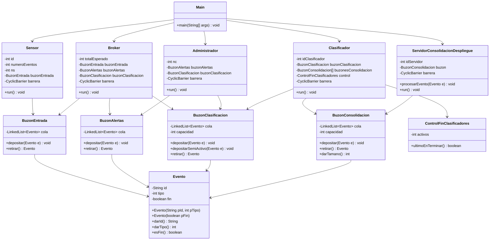

# Informe Caso 3 - Concurrencia y Sincronización de Procesos

**Universidad de los Andes — ISIS 1311 Tecnología e Infraestructura de Cómputo — 2026-1**

## Integrantes del grupo

- Alejandro Cruz Acevedo — 201912149
- Nicolás Castaño Calderón — 202420324

## 1. Contexto

Este proyecto implementa un simulador concurrente de un sistema IoT para un campus universitario, siguiendo la arquitectura descrita en el enunciado del Caso 3. El sistema modela una cadena de procesamiento de eventos con cinco tipos de actores (sensores, bróker, administrador, clasificadores y servidores de consolidación) que cooperan y compiten por recursos compartidos a través de buzones sincronizados.

El objetivo técnico de la implementación es mostrar:

- Paso de eventos entre múltiples productores y consumidores en una arquitectura tipo pipeline.
- Sincronización usando exclusivamente primitivas básicas de Java: `synchronized`, `wait()`, `notifyAll()`, `yield()`, `join()` y `CyclicBarrier`.
- Uso combinado de patrones de espera pasiva y espera semi-activa, según lo indicado en la Figura 1 del enunciado.
- Terminación coordinada del sistema usando eventos de fin propagados por la cadena.
- Evasión de condiciones de carrera y bloqueos mutuos mediante el uso correcto de monitores y variables condicionales.

## 2. Estructura del proyecto

Los archivos `.java` del proyecto están en la carpeta `src`. La implementación se dividió en dos bloques: la mitad de entrada del sistema (sensores, bróker, administrador) y la mitad de clasificación y consolidación (clasificadores y servidores), más un orquestador principal que lee la configuración e inicia el sistema.

| Archivo                                | Propósito                                                                                                                             |
| -------------------------------------- | ------------------------------------------------------------------------------------------------------------------------------------- |
| `Evento.java`                          | Define la estructura básica de un evento, con id, tipo y bandera de fin.                                                              |
| `BuzonEntrada.java`                    | Buzón ilimitado donde los sensores depositan los eventos generados.                                                                   |
| `BuzonAlertas.java`                    | Buzón ilimitado donde el bróker deposita los eventos anómalos; el administrador los consume con espera semi-activa.                   |
| `BuzonClasificacion.java`              | Buzón acotado (tam1) para eventos listos para clasificar. Tiene dos modos de depósito: pasivo (bróker) y semi-activo (administrador). |
| `BuzonConsolidacion.java`              | Buzón acotado (tam2) para cada servidor de consolidación.                                                                             |
| `Sensor.java`                          | Hilo productor que genera un número asignado de eventos y los deposita en el buzón de entrada.                                        |
| `Broker.java`                          | Hilo que lee del buzón de entrada, clasifica eventos como normales o anómalos, y los reenvía al buzón correspondiente.                |
| `Administrador.java`                   | Hilo que lee alertas con espera semi-activa, descarta las confirmadas y reenvía las inofensivas al buzón de clasificación.            |
| `Clasificador.java`                    | Hilo consumidor que toma eventos del buzón de clasificación y los enruta al buzón del servidor correspondiente.                       |
| `ControlFinClasificadores.java`        | Contador compartido para detectar al último clasificador en terminar.                                                                 |
| `ServidorConsolidacionDespliegue.java` | Hilo consumidor que procesa eventos de su buzón y termina al recibir un evento fin.                                                   |
| `Main.java`                            | Programa principal: lee el archivo `config.txt`, instancia los componentes, arranca los hilos y espera su terminación con `join()`.   |
| `PruebaTuParte.java`                   | Driver auxiliar heredado de pruebas tempranas del submódulo de clasificación. No se usa en la ejecución completa del sistema.         |

El archivo de configuración `config.txt` contiene los parámetros en formato `clave=valor`:

```
ni=2
base=2
nc=2
ns=2
tam1=3
tam2=2
```

## 3. Diseño de clases

### 3.1 `Evento`

Contenedor de datos con tres atributos: `id` (identificador textual), `tipo` (entero entre 1 y ns que indica el servidor destino) y `fin` (bandera booleana para eventos de terminación). Tiene dos constructores: uno para eventos normales y otro para eventos de fin. Ofrece los métodos `darId()`, `darTipo()` y `esFin()`.

### 3.2 `BuzonEntrada`

Buzón de capacidad ilimitada implementado con `LinkedList<Evento>`, sincronizado con monitor. El método `depositar(Evento e)` nunca bloquea porque la capacidad no tiene límite, y después de insertar hace `notifyAll()` para despertar al bróker. El método `retirar()` usa espera pasiva: si la cola está vacía, el hilo se duerme con `wait()` dentro de un `while`.

### 3.3 `BuzonAlertas`

Estructura análoga al buzón de entrada, pero el método `retirar()` implementa **espera semi-activa**: en lugar de usar `wait()`, el hilo entra en un bucle que llama a `Thread.yield()` mientras la cola esté vacía, cediendo el procesador sin quedarse dormido. Esto cumple con la indicación de la Figura 1, donde la rama de alertas aparece marcada con flechas punteadas.

### 3.4 `BuzonClasificacion`

Buzón de capacidad limitada `tam1`. Tiene un único método `retirar()` con espera pasiva (los clasificadores), y **dos métodos de depósito**:

- `depositar(Evento e)`: espera pasiva. Si el buzón está lleno, el hilo se duerme con `wait()`. Lo usa el bróker.
- `depositarSemiActivo(Evento e)`: espera semi-activa. Si el buzón está lleno, el hilo entra en un bucle con `Thread.yield()` hasta que haya espacio. Lo usa el administrador.

Esta distinción es necesaria porque la Figura 1 muestra que el bróker llega al buzón de clasificación por una flecha sólida (pasiva), mientras que el administrador llega por una punteada (semi-activa). En ambos casos, tras depositar se hace `notifyAll()` para despertar a los clasificadores que pudieran estar dormidos.

### 3.5 `BuzonConsolidacion`

Buzón de capacidad limitada `tam2`, uno por servidor. Usa `synchronized`, `wait()` y `notifyAll()` en ambos extremos (depósito y retiro). El método `darTamano()` permite consultar la ocupación de forma sincronizada, útil para validación.

### 3.6 `Sensor`

Hereda de `Thread`. Recibe por constructor: su `id`, el `numeroEventos` que debe generar (calculado como `base × id` en el `Main`), el número de servidores `ns`, el `BuzonEntrada` compartido y la barrera de arranque.

Comportamiento:

1. Llama a `barrera.await()` como primera instrucción.
2. Genera `numeroEventos` eventos. Cada uno tiene identificador `"S{id}-{secuencial}"` y tipo pseudoaleatorio entre 1 y ns.
3. Deposita cada evento en el `BuzonEntrada`.
4. Termina al agotar su cuota e imprime un mensaje de terminación.

### 3.7 `Broker`

Hereda de `Thread`. Recibe el `totalEsperado` (calculado en el `Main` como `base × ni × (ni + 1) / 2`), el `BuzonEntrada`, el `BuzonAlertas`, el `BuzonClasificacion` y la barrera.

Comportamiento:

1. Llama a `barrera.await()`.
2. En un bucle, retira un evento del buzón de entrada y genera un número pseudoaleatorio entre 0 y 200.
3. Si el número es múltiplo de 8, envía el evento al `BuzonAlertas`.
4. Si no, lo envía al `BuzonClasificacion` con `depositar` (pasivo).
5. Cuando ha procesado `totalEsperado` eventos, deposita un `Evento` de fin en el `BuzonAlertas` y termina.

Esta decisión de diseño, en la que el `Main` calcula el total y se lo pasa por constructor, separa responsabilidades: el bróker no necesita conocer ni la cantidad de sensores ni la base de eventos.

### 3.8 `Administrador`

Hereda de `Thread`. Recibe el `BuzonAlertas`, el `BuzonClasificacion`, el número de clasificadores `nc` y la barrera.

Comportamiento:

1. Llama a `barrera.await()`.
2. En un bucle, retira eventos del `BuzonAlertas` usando espera semi-activa.
3. Si el evento es de fin, sale del bucle.
4. Si es normal, genera un número pseudoaleatorio entre 0 y 20. Si es múltiplo de 4 se considera inofensivo y se reenvía al `BuzonClasificacion` con `depositarSemiActivo`. Si no, se descarta.
5. Al terminar, antes de salir, deposita `nc` eventos de fin en el `BuzonClasificacion` usando `depositarSemiActivo`, uno por cada clasificador.

### 3.9 `Clasificador`

Hereda de `Thread`. Recibe su `id`, el `BuzonClasificacion`, el arreglo de `BuzonConsolidacion`, el `ControlFinClasificadores` compartido y la barrera.

Comportamiento:

1. Llama a `barrera.await()`.
2. Retira eventos del buzón de clasificación uno por uno.
3. Si el evento es normal, lo enruta al buzón `buzonesConsolidacion[tipo - 1]`.
4. Si el evento es de fin, llama a `control.ultimoEnTerminar()`. Si recibe `true`, genera `ns` eventos de fin y deposita uno en cada buzón de consolidación. En cualquier caso, termina.

### 3.10 `ControlFinClasificadores`

Contador entero compartido por todos los clasificadores. Tiene un único método `ultimoEnTerminar()` declarado `synchronized`, que decrementa el contador y retorna `true` si quedó en cero. Garantiza que solo un clasificador (el último) ejecute la lógica de envío de fines a los servidores.

### 3.11 `ServidorConsolidacionDespliegue`

Hereda de `Thread`. Recibe su `id`, su `BuzonConsolidacion` y la barrera.

Comportamiento:

1. Llama a `barrera.await()`.
2. Retira eventos de su buzón.
3. Si es normal, lo procesa durmiendo un tiempo pseudoaleatorio entre 100 y 1000 ms.
4. Si es de fin, termina.

### 3.12 `Main`

Programa principal. Su lógica es:

1. Lee `config.txt` con `Properties` y obtiene `ni`, `base`, `nc`, `ns`, `tam1`, `tam2`.
2. Calcula el total esperado de eventos: `base × ni × (ni + 1) / 2`.
3. Calcula el número de partes de la barrera: `ni + nc + ns + 2` (sensores, clasificadores, servidores, bróker y administrador).
4. Instancia todos los buzones, el control de fin y la barrera.
5. Instancia y arranca los hilos en orden: servidores, clasificadores, administrador, bróker, sensores. Este orden es defensivo: garantiza que los consumidores existan antes que los productores, aunque con la barrera de arranque ninguno empieza a trabajar hasta que todos estén listos.
6. Hace `join()` sobre todos los hilos y al final imprime `"Simulacion completada"`.

## 4. Diagrama de clases



## 5. Funcionamiento del programa

El flujo del sistema, desde que se ejecuta `Main` hasta su terminación, es el siguiente:

1. `Main` lee `config.txt` y calcula el total esperado de eventos y las partes de la barrera.
2. Se instancian los buzones (entrada, alertas, clasificación, consolidación por servidor), el control de fin de clasificadores y la barrera cíclica.
3. Se crean y arrancan los hilos en orden defensivo: servidores, clasificadores, administrador, bróker, sensores. Todos quedan bloqueados en `barrera.await()`.
4. Cuando el último hilo llega a la barrera, todos se liberan simultáneamente y empiezan su trabajo.
5. Los sensores generan sus eventos y los depositan en el buzón de entrada. Cada sensor termina al agotar su cuota.
6. El bróker lee eventos del buzón de entrada y los clasifica como normales (van al buzón de clasificación) o anómalos (van al buzón de alertas). Cuando procesa el total esperado, manda un evento de fin al buzón de alertas y termina.
7. Los clasificadores consumen eventos del buzón de clasificación y los enrutan al buzón del servidor correspondiente según su tipo.
8. El administrador consume eventos del buzón de alertas. Los que pasan la inspección los reenvía al buzón de clasificación; los demás los descarta. Al recibir el fin del bróker, deposita `nc` eventos de fin en el buzón de clasificación y termina.
9. Cada clasificador, al recibir su evento de fin, registra su terminación en `ControlFinClasificadores`. El último clasificador en terminar deposita `ns` eventos de fin, uno por cada buzón de consolidación.
10. Cada servidor termina al consumir el evento de fin de su buzón.
11. `Main` hace `join()` sobre todos los hilos y confirma el cierre con `"Simulacion completada"`.

## 6. Estrategia de sincronización

### 6.1 Espera pasiva vs espera semi-activa

El enunciado exige usar los dos patrones según indica la Figura 1. La correspondencia en el código es la siguiente:

- **Espera pasiva** (flechas sólidas en la figura): implementada con `synchronized` + `wait()` + `notifyAll()`. Se usa en el camino principal del pipeline: Sensor → Bróker → Clasificador → Servidor. El hilo que espera libera el monitor y queda dormido hasta que otro hilo lo despierte, sin consumir CPU.

- **Espera semi-activa** (flechas punteadas): implementada con un bucle `while(condicion) { Thread.yield(); }`. Se usa en la rama de alertas: Bróker → Administrador → Clasificador. El hilo no se duerme sino que cede el procesador repetidamente hasta que la condición cambia. Consume un poco más de CPU que la pasiva pero responde más rápido a cambios de estado.

En concreto:

- El `BuzonAlertas.retirar()` implementa espera semi-activa del lado del administrador.
- El `BuzonClasificacion.depositarSemiActivo()` implementa espera semi-activa del lado del administrador cuando el buzón está lleno.

Todos los demás puntos de espera del sistema son pasivos.

### 6.2 Barrera de arranque con `CyclicBarrier`

El enunciado lista explícitamente `CyclicBarrier` entre las primitivas permitidas. Se emplea en el proyecto como barrera de arranque: todos los hilos (sensores, bróker, administrador, clasificadores y servidores) llaman a `barrera.await()` como primera instrucción de su `run()`. El número de partes de la barrera se calcula como `ni + nc + ns + 2` (sumando los sensores, clasificadores, servidores, el bróker y el administrador).

Esto garantiza que ningún hilo empiece a producir o consumir hasta que todos los demás estén efectivamente arrancados, lo que facilita la interpretación de los logs de ejecución y elimina variaciones de comportamiento asociadas al orden en que el planificador del sistema operativo activa los hilos.

### 6.3 Sincronización por pareja de objetos

Siguiendo lo pedido en el enunciado, se detalla la sincronización para cada pareja de objetos que interactúa a través de un recurso compartido.

**Sensor ↔ BuzonEntrada.** Relación productor-recurso. Los sensores son productores. El buzón es ilimitado, por lo que `depositar()` nunca bloquea, pero sigue estando declarado `synchronized` para garantizar exclusión mutua en la manipulación de la cola entre múltiples sensores concurrentes. Después de insertar se hace `notifyAll()` para despertar al bróker si está dormido.

**BuzonEntrada ↔ Broker.** El bróker es el único consumidor. En `retirar()` se usa espera pasiva con `while (cola.isEmpty()) wait();`. Cuando un sensor deposita y hace `notifyAll()`, el bróker reanuda, revalida la condición con `while` (para protegerse contra despertares espurios) y toma el evento.

**Broker ↔ BuzonAlertas.** El bróker es productor. Como el buzón es ilimitado, no bloquea al depositar, pero el método es `synchronized` para evitar condiciones de carrera con el administrador que lee concurrentemente.

**BuzonAlertas ↔ Administrador.** El administrador es el único consumidor y aquí se usa espera **semi-activa**: `retirar()` revisa si la cola está vacía en un bucle `while` con `Thread.yield()`. Esto significa que el administrador no se duerme, sino que cede el procesador y vuelve a chequear. El método sigue siendo `synchronized` para que la prueba de la condición y el retiro del elemento sean atómicos.

**Broker ↔ BuzonClasificacion.** El bróker deposita con `depositar()` (pasivo). Si el buzón está lleno (capacidad `tam1`), se duerme con `wait()` hasta que un clasificador retire un evento y haga `notifyAll()`.

**Administrador ↔ BuzonClasificacion.** El administrador deposita con `depositarSemiActivo()`. Si el buzón está lleno, entra en un bucle `while` con `Thread.yield()` hasta que un clasificador libere espacio. Tras insertar hace `notifyAll()` para despertar a los clasificadores que pudieran estar esperando por eventos.

**BuzonClasificacion ↔ Clasificador.** Los clasificadores son consumidores y usan espera pasiva: `retirar()` duerme con `wait()` mientras la cola esté vacía. Después de retirar hace `notifyAll()` para desbloquear a los productores (bróker o administrador) que estén esperando por espacio.

**Clasificador ↔ BuzonConsolidacion.** Los clasificadores son productores con espera pasiva. Si el buzón del servidor destino está lleno (capacidad `tam2`), el clasificador se duerme hasta que el servidor retire un evento.

**BuzonConsolidacion ↔ Servidor.** El servidor es consumidor con espera pasiva. Espera con `wait()` mientras su buzón esté vacío; al llegar un evento, un `notifyAll()` en el `depositar()` del clasificador lo despierta.

**Clasificador ↔ Clasificador (vía ControlFinClasificadores).** Los clasificadores compiten por actualizar el contador de activos al terminar. El método `ultimoEnTerminar()` es `synchronized` para asegurar que el decremento y la comparación con cero se ejecuten de forma atómica. Esto garantiza que exactamente un clasificador —el último que termina— reciba el retorno `true` y asuma la responsabilidad de enviar los eventos de fin a los servidores, eliminando cualquier condición de carrera en la detección del último.

**Todos los hilos ↔ CyclicBarrier.** La barrera de arranque sincroniza el inicio de todos los hilos del sistema mediante `await()`. Cuando las `ni + nc + ns + 2` partes han llegado, la barrera libera simultáneamente a todos los hilos.

## 7. Validación

Se realizaron dos pruebas de ejecución con el objetivo de verificar la corrección funcional, la conservación de eventos y la ausencia de bloqueos mutuos o buzones con eventos remanentes al final.

### 7.1 Prueba 1: configuración básica

Configuración:

```
ni=2  base=2  nc=2  ns=2  tam1=3  tam2=2
```

Total esperado de eventos: `2 × 2 × 3 / 2 = 6`. Partes de la barrera: `2 + 2 + 2 + 2 = 8`.

Extracto de la ejecución observada:

```
Configuracion: ni=2 base=2 nc=2 ns=2 tam1=3 tam2=2
Total eventos esperados: 6, partes barrera: 8
Sensor 1 termina (2 eventos).
Sensor 2 termina (4 eventos).
Broker termina (6 eventos procesados).
Clasificador 2 envió evento S2-1 al servidor 2
Servidor 1 procesando evento S1-2 de tipo 1
...
Administrador termina, envió 2 FINes a BuzonClasificacion.
Clasificador 1 termina.
Clasificador 2 termina.
Servidor 1 termina.
Servidor 2 termina.
Simulacion completada.
```

Verificaciones:

- El sensor 1 generó 2 eventos y el sensor 2 generó 4, sumando 6. Coincide con el total esperado.
- El bróker reporta haber procesado 6 eventos, coincidente con el total.
- Se contaron 5 eventos reenviados por los clasificadores a los servidores. Los 5 + 1 descartado por el administrador dan 6, que es el total. La conservación de eventos se cumple.
- El administrador depositó exactamente 2 eventos de fin en el buzón de clasificación, igual al número de clasificadores.
- Todos los hilos reportaron su mensaje de terminación. No hubo cuelgue.
- El mensaje final `"Simulacion completada"` confirma que `Main.join()` pudo cerrarse para todos los hilos, lo que implica que ningún hilo quedó bloqueado.

### 7.2 Prueba 2: configuración de estrés

Configuración:

```
ni=3  base=5  nc=5  ns=2  tam1=2  tam2=2
```

Total esperado de eventos: `5 × 3 × 4 / 2 = 30`. Partes de la barrera: `3 + 5 + 2 + 2 = 12`. Esta configuración estresa la sincronización con buzones muy pequeños (`tam1=2`, `tam2=2`) y alta concurrencia (5 clasificadores compitiendo por 2 buzones de consolidación). Es el escenario donde más probable sería observar un deadlock si hubiera un bug en la sincronización.

Verificaciones sobre la traza obtenida:

- Sensor 1 generó 5 eventos, sensor 2 generó 10 y sensor 3 generó 15. Total: 30. Coincide con el esperado.
- El bróker reportó "30 eventos procesados".
- Se contaron 28 eventos reenviados por los clasificadores a los servidores. Los dos faltantes (`S2-6` y `S3-5`) corresponden a alertas confirmadas por el administrador y descartadas. 28 procesados más 2 descartados igualan los 30 totales. La conservación se mantiene.
- El administrador reportó "envió 5 FINes a BuzonClasificacion", igual al número de clasificadores.
- Los 5 clasificadores reportaron terminación. Los 2 servidores reportaron terminación.
- La ejecución terminó con `"Simulacion completada"` sin cuelgue ni necesidad de interrupción externa.

### 7.3 Observaciones sobre el orden de terminación

Las trazas de ambas pruebas muestran un orden causal correcto de terminación: sensores primero (agotan su cuota), luego el bróker (al procesar el total), luego el administrador (al recibir el fin del bróker), luego los clasificadores (al consumir los fines del administrador) y finalmente los servidores (al consumir los fines del último clasificador). Este orden es consistente con la cadena de propagación de eventos de fin descrita en el enunciado.

## 8. Conclusión

La implementación cubre la arquitectura completa descrita en el enunciado, respetando las restricciones sobre las primitivas permitidas. El uso combinado de espera pasiva y semi-activa se aplica en los puntos que indica la Figura 1, y la `CyclicBarrier` agrega un punto de sincronización global al arranque que simplifica el análisis de ejecución.

La coordinación de terminación funciona correctamente en ambas direcciones de la cadena: los eventos de fin se propagan desde el bróker hasta los servidores pasando por el administrador y los clasificadores, y el patrón del último clasificador asegura que los servidores reciban un único evento de fin cada uno. Las pruebas de validación muestran conservación de eventos, terminación limpia y ausencia de bloqueos mutuos, incluso bajo una configuración de estrés con buzones muy pequeños y alta concurrencia.
